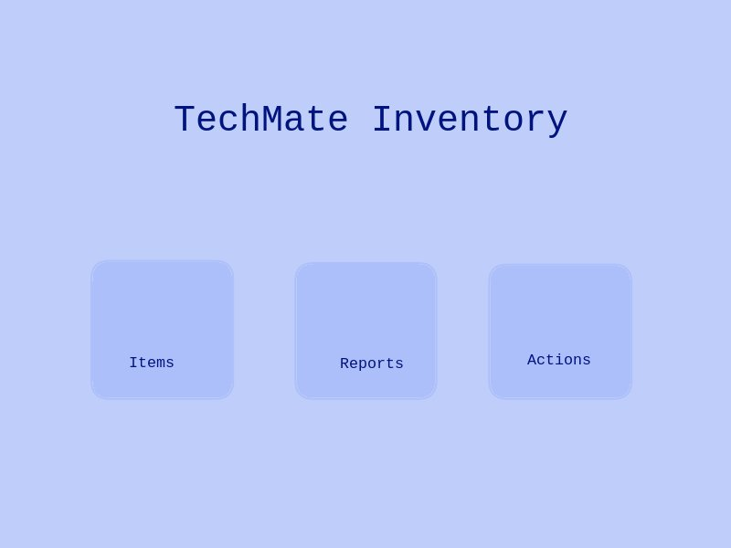

## This is the entry point to the App

### Three options are provided in navigation

	1. "Quick Actions" provides for specific guided actions e.g. donating a device, updating maintenace status etc
	2. "Reports" provides formatted and filtered listing suitable for publishing
	1. "Full Management" shows listings of all the Items under each Item Class, and allows CRUD on all items and fields

