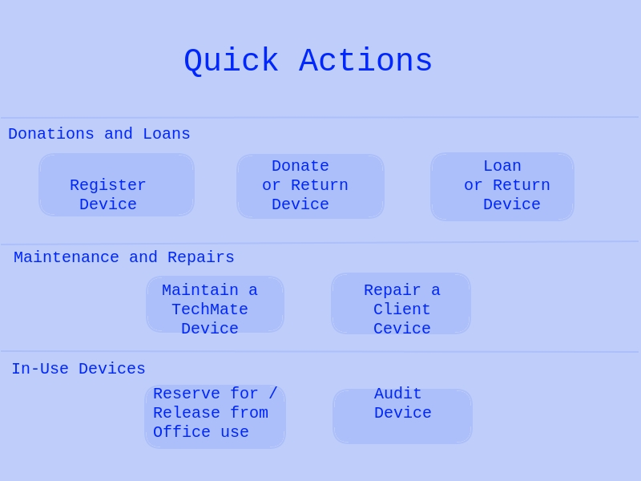

## Quick Actions

Nav links to a range of forms that allow guided actions

### Donations and Loans

1. Register Device - Add a device from partner or donor for purposes of donation
2. Donate or Return Device - tag an esixting device as donated, or recipient has returned the device
3. Loan or Return Device - tag an esixting device as on loan, or recipient has returned the device

### Maintenance and Repairs
1. Maintain a TechMate Device - for internal, non-urgent jobs
2. Repair a Client Device - for external clients

### In-Use Devices
1. Reserve or Release from Office Use - just a toggle
2. Audit Device - perform a data audit of in-use device

